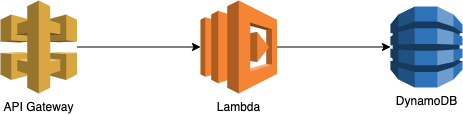

# Yellow plane telegram bot

Yellow plane is a telegram bot that is designed to broadcast messages to the different teams.

Use next commands to join and leave teams:

```text
/join team
/leave team
```

To broadcast a message to your team send this JSON with team alias and a message:

```json
{
    "team": "team",
    "message": "Hello world!"
}
```

## How it works



## References

To broadcast messages with PHP use this SDK: 
https://github.com/dontgiveafish/yellow-plane-sdk-php
